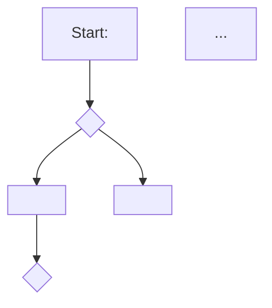
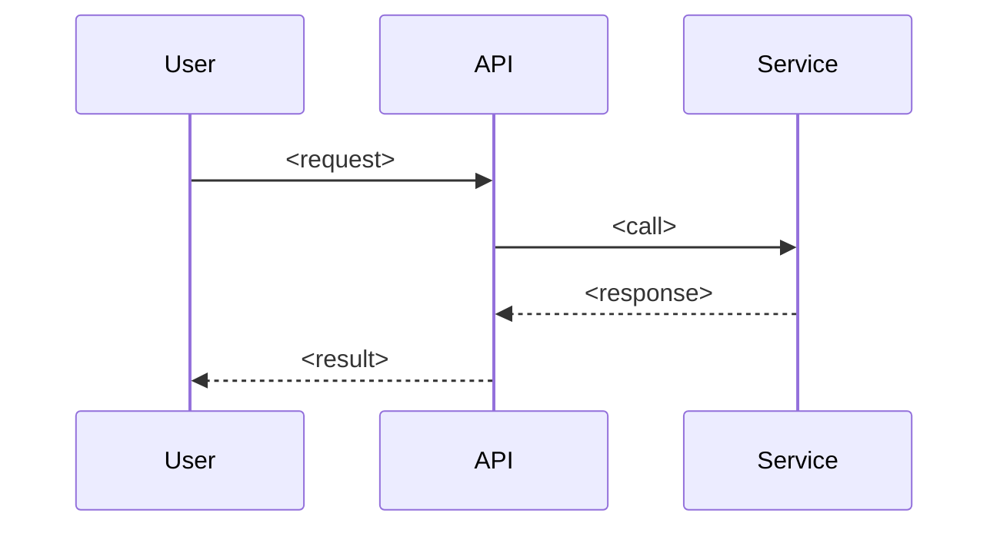

# User Story Documentation (GrindStats project variant)

This skill turns a feature idea into a small, linked set of documents that a real engineering team would recognize: a refined story, acceptance criteria written as concrete scenarios, a test-case table derived from those scenarios, and — once all of that exists — a diagram of the actual flow. The four artifacts build on each other in order. Don't skip ahead to test cases before the acceptance criteria exist, and don't draw the diagram until the story, AC, and test cases are all written, because the diagram's job is to visualize what those documents already say, not to invent new behavior.

This is the project-local copy of the `user-story-documentation` skill, customized for this repo: it adds a mandatory story **code** (Phase 0) that goes into the folder name, because GrindStats already uses document codes elsewhere (`SRS-AUTH-001`) and stories should be referenceable the same way — in commit messages, PR titles, and cross-links — without spelling out the full slug.

## Why the order matters

A story written before anyone has asked "what happens when..." questions is usually too vague to build acceptance criteria from. Acceptance criteria written before test cases give the test cases something concrete to trace back to (a reviewer should be able to point at any test case and name the AC scenario it verifies). And a diagram drawn from a fully-specified flow is accurate; a diagram drawn from a one-line idea is a guess wearing a diagram's clothes. Each phase below exists to make the next phase easy and grounded.

## Phase 0 — assign a code, and figure out where this is going to live

Every story gets a code before anything else, because the code goes into the folder name and every file inside references it, so getting it wrong late means renaming and re-linking everything.

**Code format:** `<AREA>-<NNN>`, area-prefixed and zero-padded to 3 digits, sequential *within its area* (not globally). Pick the area prefix from what the story is actually about, not from where it happens to live in the codebase — e.g. `LAND-` for the public landing page, `AUTH-` for anything in the authentication/session domain, and a new short, all-caps prefix (3-5 letters, evocative of the domain — `NUTR-`, `ROUT-`, `METR-`, `CHAT-`) for other domains as they come up. Don't invent a new prefix for a story that clearly belongs to an existing area just to avoid checking the counter.

**Before assigning a code**, read `docs/stories/index.md` — it keeps a "next available code per area" list specifically so this doesn't require scanning every folder. If the index doesn't have an entry for the area yet, this is the first story in that area: start at `-001`.

The folder layout:

```
docs/stories/<CODE>-<slug>/
├── story.md                 # Phase 1 output — starts with the code under the title
├── acceptance-criteria.md   # Phase 2 output
├── test-cases.md            # Phase 3 output
└── diagram.md                # Phase 4 output
```

`<slug>` is still a short kebab-case name from the feature's core capability (e.g. `meal-photo-estimation`), exactly as before — the code prefixes it, it doesn't replace it. So a story about meal photo estimation in the nutrition area, if it's the first nutrition story, becomes `docs/stories/NUTR-001-meal-photo-estimation/`.

Immediately under the H1 title in `story.md`, add a line: `` **Code:** `<CODE>` ``. Any epic overview, index entry, or cross-story reference that links to this story should show the code alongside the link, not just the slug — a reader scanning a table should be able to find "AUTH-003" without opening the file.

Check the project for other docs conventions (`CLAUDE.md`, `CONTRIBUTING.md`) and follow them too if they say more than this. If the user just wants the content in the chat rather than filed into the repo, skip the file layout but still state the assigned code up front — it costs nothing and keeps the option open to file it later.

## Phase 1 — refine the story

The user's starting material is often thin or spread across several messages: a feature name, a complaint, a half-formed idea, a screenshot description. Your job here is elicitation, not transcription — don't just reformat what they said into "As a user, I want X" and call it done. A story is ready to move on only once you can answer, from what's actually been said (not assumed):

- **Who** is the actor? Be specific — "a logged-in user tracking cardio training" beats "a user" when the feature only makes sense for that actor.
- **What** capability do they want, stated as an outcome, not an implementation ("see my weekly volume trend" not "add a GROUP BY query").
- **Why** — the benefit or motivation. If you can't state this in one clause, you probably don't understand the feature well enough yet to spec it.
- **Trigger/context** — what state the user or system is in when this applies, and what starts the flow.
- **Boundaries** — what's explicitly out of scope, and any constraints (performance, data availability, existing behavior that must not change).
- **Dependencies** — other features, services, or data this relies on, including other coded stories it builds on or connects to.

Gaps in these are exactly what you should ask the user about — use your question tool if one is available, or ask inline if not. Don't invent plausible-sounding answers to fill gaps; an incorrect assumption here quietly corrupts every downstream document. It's fine to take two or three rounds of back-and-forth to nail this down — that's the "multiple prompts" this skill is named for: each round should visibly sharpen the story, not just restate it.

If a single request clearly bundles multiple distinct actor-capability pairs (e.g. an SRS or epic covering both a `User` role and a `SystemAdmin` role, or several independent FR groups), don't force it into one story with a sprawling AC list. Split it into multiple coded stories — same area prefix, incrementing numbers — tied together by a short epic overview file that explains the split and the dependency order between them. Confirm the split with the user before writing four files per story; it's a real fork, not a detail.

Once the gaps are closed, write `story.md`:

```markdown
# <Story Title>

**Code:** `<CODE>`

**As a** <specific role/actor>
**I want** <capability, stated as outcome>
**So that** <benefit/motivation>

## Description
<2-5 sentences of narrative context: when this comes up, why it matters, how it fits
the rest of the product. This is the paragraph a teammate reads when the one-liner
above isn't enough.>

## In scope
- <bullet per included behavior>

## Out of scope
- <bullet per explicitly excluded behavior — worth stating even if "obvious",
  because it's what stops scope creep later>

## Dependencies / assumptions
- <bullet per thing this relies on, naming other stories by code where relevant>

## Open questions
- <anything still unresolved — carry these forward rather than silently guessing>
```

An empty "Open questions" section is a good sign. A full one isn't a failure — it's honest, and better than a story that looks complete but rests on unstated guesses.

## Phase 2 — acceptance criteria

Write two layers, because they serve different readers:

**A plain checklist** first — the fast, skimmable version a product owner reads to confirm scope:

```markdown
## Acceptance criteria (summary)
- [ ] <criterion 1, one sentence, testable>
- [ ] <criterion 2>
```

**Then scenario-based criteria in Gherkin**, which is what makes criteria testable rather than just descriptive. Cover the happy path, then deliberately go looking for the cases that get skipped when someone rushes: alternate paths, boundary/edge conditions, and negative/error cases. A story with only a happy-path scenario is unfinished, not simple.

```markdown
## Acceptance criteria (scenarios)

### Scenario: <short name — happy path>
**Given** <precondition/state>
**And** <additional precondition, if needed>
**When** <the action/trigger>
**Then** <observable outcome>
**And** <additional outcome, if needed>

### Scenario: <edge case — e.g. boundary value, empty state, concurrent action>
Given/When/Then...

### Scenario: <negative case — invalid input, unauthorized, dependency failure>
Given/When/Then...
```

Name each scenario descriptively ("Scenario: rejects a photo estimate older than the 24h confirm window", not "Scenario 3") — the name should tell a reader what's being verified without opening the Given/When/Then. Ground every scenario in something from `story.md`'s scope; if a scenario needs a rule that isn't in the story yet, that's a sign to go back and ask the user rather than inventing the rule here.

Save this as `acceptance-criteria.md`.

## Phase 3 — test cases

Derive test cases from the scenarios you just wrote — every Gherkin scenario should map to at least one test case, and scenarios with multiple meaningful data variations (a boundary at 0, at the limit, and one over) may map to several. This traceability is the point: a reviewer should be able to go from a failing test case straight to the AC scenario it was verifying.

```markdown
# Test cases: <Story Title>

| ID | Title | Type | Linked scenario | Preconditions | Steps | Test data | Expected result | Priority |
|----|-------|------|-----------------|---------------|-------|-----------|------------------|----------|
| TC-01 | <short name> | Happy path | <scenario name> | ... | 1. ...<br>2. ... | ... | ... | P1 |
| TC-02 | <short name> | Edge | <scenario name> | ... | ... | ... | ... | P2 |
| TC-03 | <short name> | Negative | <scenario name> | ... | ... | ... | ... | P1 |
```

`Type` is one of Happy path / Edge / Negative / Regression. `Priority` reflects how bad it is if this breaks (P1 = breaks the core flow or loses/corrupts data, P2 = degrades an important but non-critical path, P3 = cosmetic or rare). Don't pad the table with trivial restatements of the same scenario — a handful of well-chosen cases per scenario beats a long table where half the rows test nothing new. Save this as `test-cases.md`.

## Phase 4 — the flow diagram

Only start this once `story.md`, `acceptance-criteria.md`, and `test-cases.md` all exist — the diagram should be a picture of what those documents already establish, so if you find yourself inventing a branch or a step that isn't backed by a scenario, that's a signal either the diagram is wrong or the acceptance criteria are missing a case (go fix the AC, don't quietly draw around the gap).

**Default to a flowchart** of the functional logic — the steps, decision points, and branches (including the edge/negative-case branches from Phase 2, not just the happy path). Use Mermaid so it renders natively in most places this ends up (GitHub, many editors, and Claude Artifacts):

````markdown
# Flow: <Story Title>



<1-2 sentences per non-obvious branch, if the diagram alone doesn't make it clear why
that branch exists — reference the AC scenario it corresponds to.>
````

**Switch to a sequence diagram instead** when the story is really about coordination between actors/services over time rather than internal branching logic — e.g. a request hopping through a gateway, a service, an external API, and a queue. In that case use participants for each actor and show the calls in order:



Use judgment rather than picking mechanically: if the story's scenarios are mostly "if X then Y, else Z", it's a flowchart; if they're mostly "the user does something, which causes service A to call service B, which notifies C", it's a sequence diagram. A story can occasionally warrant both — don't force it into one shape if the flow genuinely has both a decision tree and a multi-actor handoff worth showing separately.

Save the result as `diagram.md`. If the user is working in a session that can publish Artifacts and would clearly want a shareable/interactive version (they mention showing it to someone, or ask to "see" it rather than just have the file), offer to also publish it as one — but the markdown file with the embedded Mermaid block is the artifact this skill always produces, since it's what stays version-controlled next to the other three documents.

## Wrapping up

After all four files exist, tell the user where they landed (the folder, **with its code**, not just "done") and give a one-line summary of what's in each rather than repeating their contents back — they can open the files. Update `docs/stories/index.md`: add the new story's row (with its code) to the right table, and bump that area's "next available code" entry so the next story doesn't collide. If this story is part of a multi-story split (Phase 1), also update or create the epic overview file. If Phase 1 left open questions, surface them again here — an open question that quietly disappears by Phase 4 is worse than one that's still visibly flagged.
