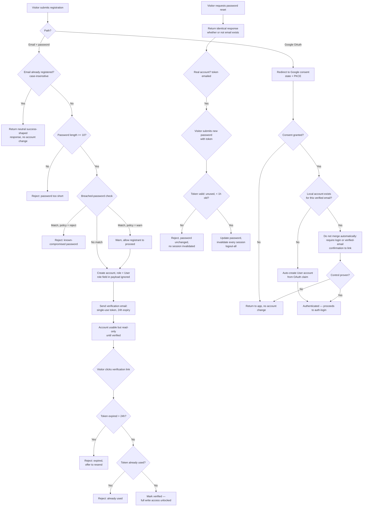

# Flow: Account registration

Registration branches heavily on validation and identity-linking rules, so this is a
flowchart rather than a sequence diagram — the interesting behavior is "which rule fired",
not "which service called which".

## Notes on the non-obvious branches

- **`C`/`D` and `AB` — the enumeration-protection nodes.** A duplicate registration and a
  reset request for a nonexistent email both terminate in a response indistinguishable from
  the success path, per FR-08. *(Scenarios: registration response does not confirm an email
  is already registered; password-reset request does not confirm whether the email exists.)*
- **`J` — role is set unconditionally, never read from the request.** Even though the
  diagram shows "role field in payload ignored" as an annotation rather than a branch,
  that's deliberate: there is no code path in which an incoming role value changes the
  outcome. *(Scenario: an injected role field is ignored on registration.)*
- **`P`/`R`/`T` — OAuth never silently merges identities.** An OAuth login matching an
  existing local email always requires proof of control before the two identities become
  one account, closing what would otherwise be an account-takeover path (register locally
  with a victim's email, then have them "helpfully" link it via OAuth). *(Scenario: OAuth
  login matching an existing local account requires proof of control.)*
- **`L` — verified vs unverified is a state, not a gate at login.** An unverified account
  can still authenticate; the restriction is read-only access enforced afterward, which is
  why this diagram shows it as a branch reached *after* account creation rather than a
  login-time rejection. *(Scenario: unverified account is read-only on its own data.)*
- **`AG` — password reset always triggers logout-all**, not just a password change. This is
  what makes reset a recovery mechanism against a compromised session, not only a
  compromised password. *(Scenario: password reset completes and logs out every session.)*
