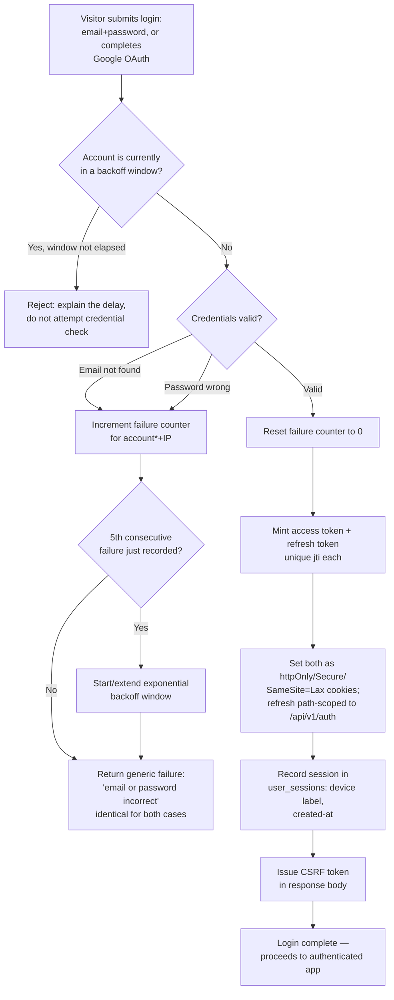

# Flow: Login and session establishment

A flowchart, since the specified behavior is almost entirely "which condition determines
the response" (backoff state, credential validity, account status) rather than a chain of
service-to-service calls.

## Notes on the non-obvious branches

- **`D` collapses two different failures into one response.** Whether the email doesn't
  exist or the password is wrong, the diagram deliberately shows both feeding the same
  generic-failure node — that convergence is the point, not a simplification of the
  diagram. *(Scenarios: wrong password gives a generic failure without revealing which
  factor failed; nonexistent email gives an identical generic failure.)*
- **`B` is checked before `D`, not after.** A request against an account already in backoff
  never reaches credential validation at all — this is what stops an attacker from using
  response-time differences between "backoff rejected" and "credentials checked" as a
  side-channel to enumerate valid accounts. *(Scenario: five consecutive failures trigger
  backoff.)*
- **The counter is per-account, and `B` doesn't branch on source IP.** A login for the same
  account from a different IP during an active window still hits `B`'s "Yes" branch — the
  backoff isn't bypassed by switching networks. *(Scenario: backoff blocks the account even
  from a new source IP.)*
- **`I` resets the counter before token issuance, not after.** A successful login always
  clears prior failures regardless of what happens downstream, so a partial failure later
  in the flow can't leave a stale failure count attached to a legitimate login.
  *(Scenario: a successful login resets the failure counter.)*
- **Google OAuth re-enters the same flow at `I`.** Once Google's consent and the
  local-account link (specified in `auth-registration`) resolve to a known account, this
  diagram treats it identically to a validated password — same token issuance, same cookie
  shape, same CSRF issuance. *(Scenario: Google OAuth login for an existing account issues
  the same session shape.)*
