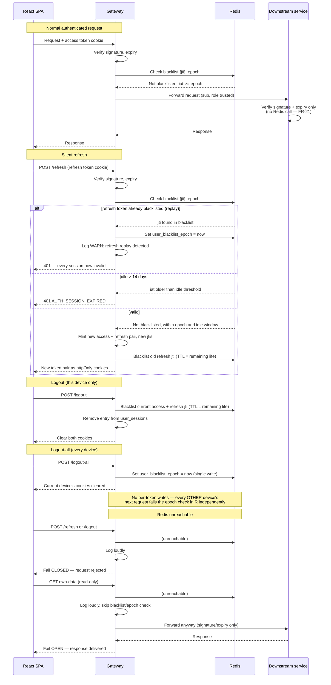

# Flow: Silent session refresh, rotation, and logout

This story is about coordination between actors over time — the SPA, the gateway (the only
Redis-consulting component), a downstream service, and Redis — so it's a sequence diagram
rather than a flowchart, unlike `auth-registration` and `auth-login` where branching logic
was the point.

## Notes on the non-obvious branches

- **The downstream service never talks to Redis, in any branch.** Every Redis interaction
  in this diagram happens at the gateway. This is the "pay for statelessness once, at the
  edge" design from blueprint §8 — it's what keeps `AUTH_INVALID_TOKEN` cheap to check on
  every internal service call. *(Scenario: downstream services trust the gateway without
  their own Redis check.)*
- **Replay sets the epoch, not just a single blacklist entry.** Presenting an
  already-rotated refresh token doesn't just fail that one request — it revokes every
  session belonging to the user, including the session that legitimately holds the new,
  valid pair from the rotation that already happened. That's deliberately aggressive:
  the system can't tell which side (attacker or legitimate holder) has which token, so it
  trusts neither. *(Scenario: replaying a rotated refresh token kills every session.)*
- **Logout-all is one write, and other devices find out independently.** The diagram shows
  no message from the gateway to any other device — logout-all doesn't push a revocation,
  it simply changes the value that every future request's epoch check reads. This is what
  makes it O(1) regardless of how many devices are logged in. *(Scenario: logout-all ends
  every session without enumerating tokens.)*
- **The Redis-unreachable branch shows two different failure directions on purpose.**
  State-changing calls (refresh, logout) fail closed; a GET fails open. This asymmetry is
  the explicit trade-off in NFR-02 — a fitness dashboard staying readable outweighs a few
  seconds of unenforced revocation on reads, but nothing that changes state is ever allowed
  to proceed unchecked. *(Scenario: Redis unreachable fails closed on refresh and open on
  reads.)*
