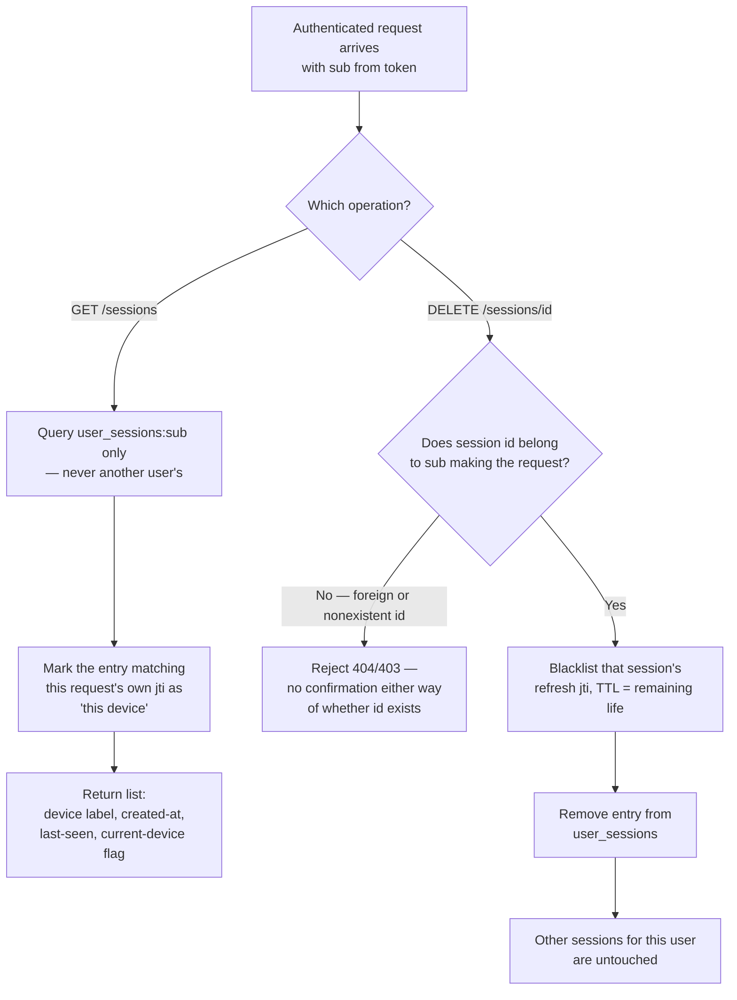

# Flow: Viewing and revoking my own sessions

A small flowchart — the whole story is one read path and one write path, both gated by
the same ownership check.

## Notes on the non-obvious branches

- **`F` returns the same rejection whether the ID belongs to someone else or doesn't exist
  at all.** Distinguishing "not yours" from "doesn't exist" would let a caller enumerate
  valid session IDs by watching which error comes back — the same enumeration-protection
  instinct as the registration and login stories, applied here to session IDs instead of
  emails. *(Scenario: a user cannot revoke another user's session.)*
- **`C` scopes the query by `sub` at the data layer, not by filtering a full list
  afterward.** The distinction matters: filtering after the fact means the query itself
  touched other users' data, which is the kind of bug that becomes a real leak the moment
  someone forgets the filter on a new code path. Scoping the query itself makes the leak
  structurally impossible rather than dependent on remembering a filter.
  *(Scenario: listing sessions never includes another user's sessions.)*
- **`H` reuses the exact blacklist mechanism from `auth-session-refresh-logout`.** This
  diagram doesn't introduce a new way to invalidate a session — revoking one here is
  identical in mechanism to what happens to the current session on `/logout`, just targeted
  at a `jti` that isn't necessarily the caller's own current one.
