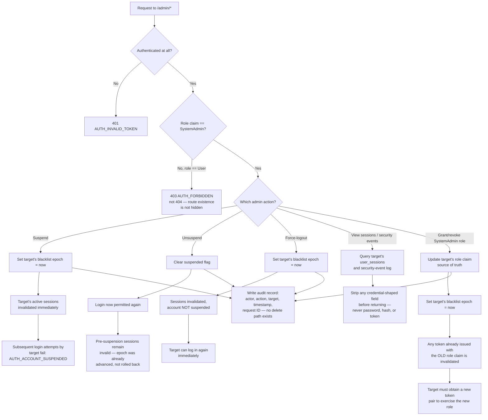

# Flow: Administering user accounts

A flowchart — the story is dominated by which check gates which action, and by the
boundary between "accounts and sessions" and "health data" that this role must never cross.

## Notes on the non-obvious branches

- **`B` is checked before `D`.** An unauthenticated request to an admin route gets 401, not
  403 — authentication failure and authorization failure are different things, and
  collapsing them would make it impossible to tell "you're nobody" from "you're the wrong
  somebody" from the response alone. *(Test case: unauthenticated request to an admin route
  is rejected before role is even considered.)*
- **`E` returns 403, deliberately not 404.** Hiding the route's existence behind a fake 404
  is a common instinct, but the SRS explicitly rejects it here (FR-22) — likely because
  admin routes aren't secret, they're role-gated, and pretending otherwise adds obscurity
  without real security. *(Scenario: a User token is forbidden, not not-found, on admin
  routes.)*
- **`R` → `S` → `T` is the same epoch mechanism as suspend and force-logout, applied to a
  role change.** A role grant/revoke doesn't get its own bespoke invalidation — it reuses
  the same "advance the epoch" primitive from `auth-session-refresh-logout`, which is why a
  stale token fails on the epoch check specifically, before the role check ever runs.
  *(Scenarios: granting SystemAdmin invalidates the target's existing tokens; revoking
  SystemAdmin immediately removes elevated access.)*
- **There is no branch from `F` that reaches health data**, and that's not an oversight in
  the diagram — no such route exists to branch to. The boundary in FR-47 is enforced by
  what endpoints exist, not by a runtime check that could be misconfigured.
  *(Scenario: admin scope cannot reach a user's health data through any admin endpoint.)*
