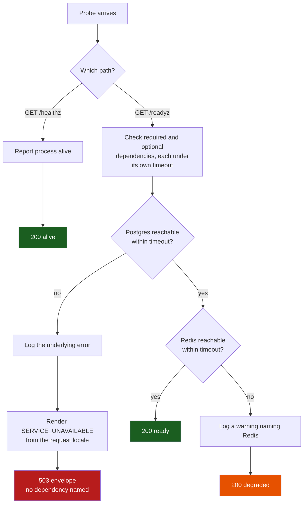
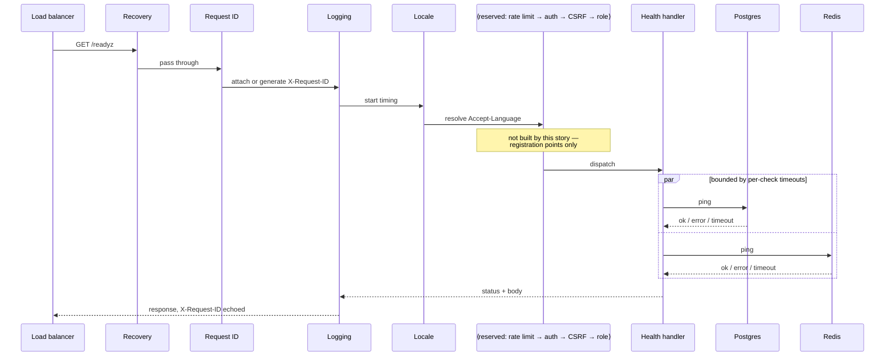

# Flow: API gateway skeleton with health and readiness probes

**Story:** [`GATE-001`](story.md) · **Criteria:** [`acceptance-criteria.md`](acceptance-criteria.md)

Two diagrams, because the story has two distinct shapes worth showing: the readiness
decision tree, and the order in which a request passes through the chain.

## 1. Probe handling and the readiness decision

**Why `/healthz` never reaches the dependency checks.** Its consumer is the container
runtime, whose response to a failure is to kill the task. Consulting Postgres here would
turn a brief outage into a rolling restart of healthy containers.

**Why Redis-unreachable exits at `200 degraded` rather than joining the 503 branch.**
NFR-02 fails open on read-only GETs when Redis is down, so the instance can still serve.
Routing this branch to 503 would empty the load balancer during a cache outage — worse than
the revocation lag it would avoid.

**Why the 503 branch logs before rendering.** The log is where the host, port and driver
error go; the response body is deliberately stripped of them, so the log line is the only
copy.

## 2. The middleware chain a probe passes through

The reserved participant is the point of this diagram. The four unbuilt stages have a fixed
position in the order, and each later story inserts its own — inserting a stage into an
existing order is cheap, whereas discovering later that CSRF ran before authentication is
not.

The `par` block reflects that the two dependency checks are independent: running them
sequentially would make the probe's worst case the sum of the timeouts rather than the
larger of the two.
