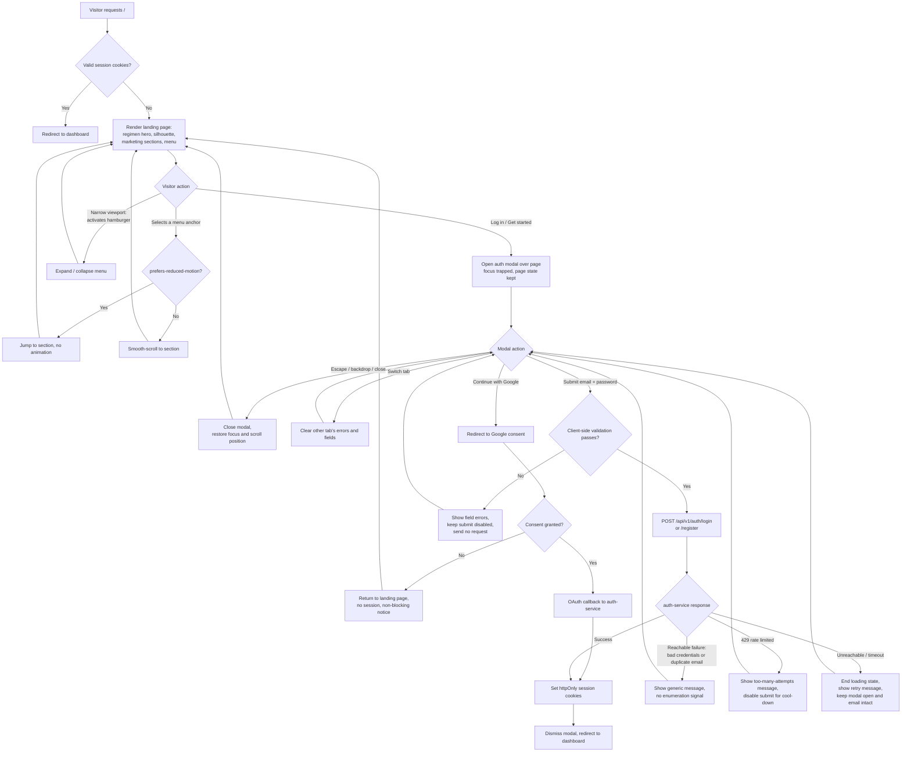

# Flow: Public landing page for unauthenticated visitors

This flowchart shows only behavior established in `story.md` and `acceptance-criteria.md`.
Each branch is traceable to a scenario; the notes below name the scenario where a branch
exists for a non-obvious reason.

## Notes on the non-obvious branches

- **`B` — session check before render.** The landing page is never the final destination
  for an authenticated visitor; the redirect happens ahead of render rather than as a
  flash of marketing content. *(Scenario: already-authenticated visitor is redirected away
  from the landing page.)*
- **`W` — one node for two different failures.** Bad credentials and duplicate
  registration deliberately converge on the same generic response, because branching them
  into distinct messages is exactly the account-enumeration leak SRS-AUTH-001 §5 forbids.
  *(Scenarios: invalid credentials do not reveal whether the email is registered;
  registering an already-registered email does not confirm the account exists.)*
- **`S` before `U` — validation gates the network call.** Malformed input never reaches
  auth-service, which keeps the rate limiter measuring real attempts rather than typos.
  *(Scenario: client-side validation blocks a malformed submission before any request.)*
- **`Y` — the unreachable branch returns to the modal, not to an error page.** The visitor
  keeps their entered email and the page they were converted by. *(Scenario: auth-service
  being unreachable surfaces an error instead of hanging.)*
- **`L` — closing restores both focus and scroll.** The modal is an overlay, not a route,
  so dismissing it must return the visitor to precisely where they were. *(Scenarios: auth
  modal opens over the page and can be dismissed without losing position; focus stays
  inside the modal while it is open.)*
- **`R` is reached from two paths.** Google OAuth and email/password converge on the same
  cookie-setting step, which is what lets the SPA stay ignorant of how the visitor
  authenticated. *(Scenarios: visitor authenticates with Google; returning visitor logs in
  and reaches the dashboard.)*
