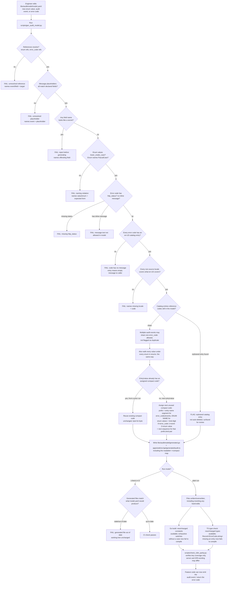
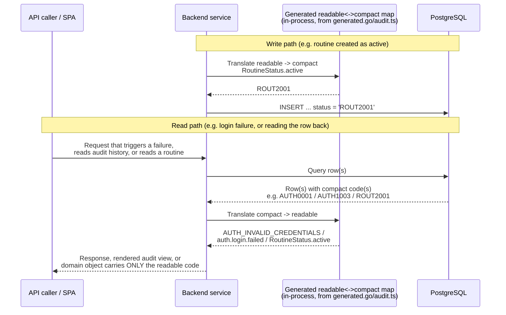

# Flow: Audit Log & Error Code Model

**Code:** `PLAT-001`

## Notes on non-obvious branches

- **C, D, E, F, G, H, I checks are independent gates, not one combined check** — each corresponds
  to its own AC scenario (unresolved enum reference, message placeholder, secret-shaped field,
  naming convention, missing `http_status` / inline message, missing en-US entry, missing
  non-source locale). The generator is expected to fail fast at the first violated gate rather
  than continue and report everything at once, per the scenarios in
  [acceptance-criteria.md](acceptance-criteria.md).
- **J (orphaned catalog entries) is a flag, not a hard failure that blocks generation** — see
  *Scenario: orphaned catalog entry after an error code is removed*. It's surfaced for a human
  to deliberately delete, not silently cleaned up, because an automatic delete could remove a
  catalog entry someone was mid-way through re-adding for a re-introduced code.
- **K (shared error codes) is explicitly a non-branch** — it's drawn to make clear that the
  generator must *not* treat two audit events sharing one `error_code` as a conflict, per
  *Scenario: several audit events share one error code deliberately*. This is the enumeration-
  protection pattern (`AUTH_INVALID_CREDENTIALS` covering both `unknown_email` and
  `bad_password`) that `docs/audit-and-errors.md` §4 calls "the most important rule in this
  document."
- **M splits into two outcomes** because the same validation logic serves two different callers:
  a plain run is expected to *fix* drift (regenerate and overwrite, including reverting a
  hand-edit — see *Scenario: hand-edited generated file is reverted*), while `--check` is
  expected to *detect* drift without writing anything, which is what makes it safe to run in CI
  before merge (*Scenario: stale generated file caught by --check*).
- **Q and R are compiler-enforced, not generator-enforced** — the generator's job ends at
  producing typed consumers; the "you must handle new values" guarantee comes from Go's
  exhaustive-switch compile error and TypeScript's `Record<ErrorCode, string>` mapped-type
  requirement, which is why AC calls this out as an intended, not incidental, effect.
- **K2/K3/K4 is where compact-code permanence lives** — an existing entry's compact code is
  never recomputed, only looked up and re-emitted (*Scenario: compact code is stable across
  unrelated regeneration*), and a new entry's assignment walks forward from the highest
  sequence number ever used for that (prefix, kind) pair, including retired ones
  (*Scenario: removed entry's compact code is retired, not recycled*).
- **K1's prefix source differs from error_codes/events** — an enum value's prefix comes from its
  *enum's* name, not the value string, specifically so `RoutineStatus.active` and
  `OccurrenceStatus.active` land on different prefixes despite an identical value spelling
  (*Scenario: enum value's compact prefix derives from the enum name, not the value*). Adding one
  new value to an existing enum only assigns that one value a code; its siblings' codes are
  untouched (*Scenario: adding a new value to an existing enum doesn't disturb existing codes*).

## Flow: compact code at runtime (read/write path)

The generation flow above is build-time. Separately, every time a service reads or writes a row
that carries a compact code — an audit record, an error condition, or a domain table column
typed to one of the enums in `model.yaml` (e.g. `routines.status`) — it must translate at the
boundary. This is a per-request sequence, not a branching decision tree, so it's shown as a
sequence diagram instead.

The compact code never crosses the `Svc-->>Caller` boundary, and application logic (an exhaustive
switch on `RoutineStatus`, a comparison against `AUTH_INVALID_CREDENTIALS`) only ever sees the
readable form (*Scenario: compact code never reaches the API response*;
*Scenario: a domain table storing an enum sees only the compact code*) — translation happens
entirely within the backend service, using the same generated map the build-time flow populates,
with no database join and no separate lookup table.
