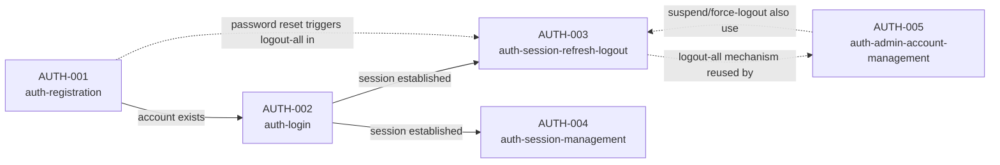

# Epic: Authentication & session management

**Source:** `docs/srs-authentication.md` (SRS-AUTH-001 v1.0). Where a story below and the
SRS disagree, the SRS wins for requirements detail; where the SRS and the published
blueprint disagree, the blueprint wins (per the SRS's own header).

SRS-AUTH-001 specifies 47 functional requirements across registration, login, request
authorization, refresh/logout, session visibility, and admin operations. Turning that
directly into one story-with-acceptance-criteria would produce a single AC document with
40+ scenarios spanning two different actors (`User` and `SystemAdmin`) and no natural
reading order. Instead it's split into five stories, each with one clear actor and one
coherent capability, linked below in the order a real user would encounter them.

Requirements in SRS §3.3 (FR-20..24 — request authorization: the gateway check chain, role
middleware, ownership checks, CSRF) have no user-facing trigger of their own, so they don't
get a sixth story. They're folded in as cross-cutting acceptance criteria wherever they're
most fully exercised: the full gateway check order lives in `auth-session-refresh-logout`
(refresh is the endpoint that hits every link in that chain), CSRF issuance lives in
`auth-login`, and the role/ownership boundary lives in `auth-admin-account-management`.

## Reading order

| Code | Story | Actor | Capability | SRS coverage |
|---|---|---|---|---|
| AUTH-001 | [auth-registration](AUTH-001-auth-registration/story.md) | Unauthenticated visitor | Create an account (email/password or Google), verify it, reset a forgotten password | §3.1 FR-01..08 |
| AUTH-002 | [auth-login](AUTH-002-auth-login/story.md) | Visitor with an existing account | Log in and receive a secure, cookie-based session | §3.2 FR-10..14, plus §3.3 FR-20/24 as they apply at login |
| AUTH-003 | [auth-session-refresh-logout](AUTH-003-auth-session-refresh-logout/story.md) | Authenticated user | Silent token refresh with replay detection; logout (one device / all) | §3.3 FR-20/21, §3.4 FR-30..34 |
| AUTH-004 | [auth-session-management](AUTH-004-auth-session-management/story.md) | Authenticated user | List and selectively revoke my own active sessions | §3.5 FR-40..41 |
| AUTH-005 | [auth-admin-account-management](AUTH-005-auth-admin-account-management/story.md) | SystemAdmin | Suspend/force-logout accounts, view sessions & security events, grant/revoke SystemAdmin — never touch health data | §3.6 FR-42..47, §3.3 FR-22/23 boundary |

## How the stories connect

The dotted lines matter for implementation order: `auth-session-refresh-logout`'s epoch
mechanism is a dependency of three other stories (password reset, session revocation reuses
the same blacklist primitive at a smaller grain, and both admin actions), not a peer of
them. Build it before or alongside `auth-registration`'s password-reset piece and
`auth-admin-account-management`, even though `auth-login` reads first in the epic.

## What's still open across the epic

Each story's own "Open questions" section has specifics; the ones that span more than one
story are worth resolving before implementation starts rather than per-story:

- **Refresh grace window** (`auth-session-refresh-logout`): if a legitimate retry can look
  identical to replay, every story that depends on the epoch mechanism (password reset,
  session revocation, both admin actions) inherits that ambiguity.
- **Account deletion** (`auth-admin-account-management`): the SRS specifies suspension but
  never deletion. Worth deciding whether that's a deliberate omission (health-data retention
  makes deletion its own, larger story) before an admin UI implies it's missing by accident.
- **First-SystemAdmin bootstrap**: assumed to be a direct database operation; not stated
  outright anywhere in the SRS. Confirm before the deployment runbook is written.

## Roadmap placement

Per the blueprint's roadmap (§20), this epic is Phase 2 ("Real auth"), after Phase 1's
modular-monolith MVP ships with no auth beyond a stub. Priority-M requirements across all
five stories are what Phase 2 must deliver; Priority-S items (email verification's
enforcement details, session-listing last-seen, most SystemAdmin capabilities) can slip to
immediately after Phase 2 without blocking it — see each story's requirement table for
which FRs carry which priority.
